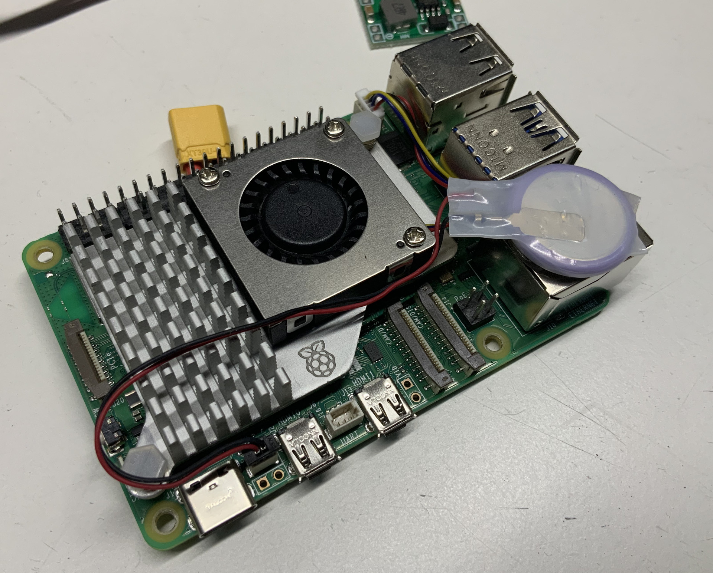

# Camera Computers

[__NOTE:__ This document is in flux, as the design has been "evolving" into something different than what we flew in August, and is therefore a moving target. So some of this information is incomplete, or half-finished, as the plan likely changed and I was distracted away as I was writing it.]

The X500 V2 drone platform used two Raspberry Pi 5 computers to provide three MIPI-CSI camera ports for three cameras.

## Hardware

We have had two major revisions of the camera computer system. We started out with two Raspberry Pi 5s (16 GB RAM) serving the three cameras in the system. We've since moved to three Raspberry Pi Zero 2 Ws, with one camera attached to each, and wiring to synchronize everything.

### Variant: Raspberry Pi 5

Attach the [active heat sink](https://www.raspberrypi.com/products/active-cooler/) to the Raspberry Pi and connect the fan/tachometer cable to the connector on the Raspberry Pi labeled "FAN" and "J17", at the edge of the board, behind the USB type-A connectors.

Attach the [RTC battery](https://www.raspberrypi.com/products/rtc-battery/) to the Raspberry Pi. I chose to peel the adhesive on the battery and stick it to the top of the Ethernet jack. Attach the battery cable to the connector labeled "BAT" and "J5". Route the cable through the fins of the heat sink to keep the cable from getting hooked by debris and whatnot.



Instructions for attaching battery buck regulator outputs is documented in the [X500 vehicle notes](../../vehicles/x500v2/README.md#regulator-modification).

Install the two Raspberry Pis on the camera mount.

One of the Pis (we'll call it "drone-1") has two cameras attached:

* MIPI-CSI port 0, labeled "CAM/DISP0" and "J3": nadir camera.
* MIPI-CSI port 1, labeled "CAM/DISP1" and "J4": forward camera.

The other Pi (call it "drone-2") has one camera attached.

* MIPI-CSI port 0, labeled "CAM/DISP0" and "J3": side camera.

Each ArduCam camera should come with two cables. One cable has 1.0 mm pitch, 15-pin connections on both ends. The other cable has a 0.5 mm pitch, 22-pin connection on one end, and a 1.0 mm pitch, 15-pin connection on the other. Older Raspberry Pi products use the 1.0 mm pitch, 15-pin connectors. The Raspberry Pi 5 uses 0.5 mm pitch, 22-pin connectors.

For each camera, use the 22-to-15 cable between the Raspberry Pi MIPI-CSI connector to a [MIPI-CSI extender](https://www.adafruit.com/product/3671). From the other side of the MIPI-CSI extender to the ArduCam IMX477 camera, use the 15-to-15 cable. Once you have the Raspberry Pis and cameras attached to the camera mount, find comfortable places to attach the MIPI-CSI extenders, using double-sided tape, so that the cables are out of the way and not pulling or scraping on anything as the camera mount and vehicle vibrate. I attached them to reasonable spots on the lower spider.

__TODO__: Find reasonable-length 22-to-22 cables, and ditch the double-cable + MIPI-CSI extender jank.

__TODO__: Describe camera spider assembly here? It looks like no instructions with the 3D prints README.

### Variant: Raspberry Pi Zero 2 W

Three Pi Zero 2 Ws are used. Since each Pi has only one camera interface, we connect one camera to each Pi. A camera trigger signal is generated from a single KB2040 microcontroller, and delivered to each of the cameras. Each camera is configured on its Pi to wait for a trigger signal to capture each image.

Each Pi uses about 250 average and 350 mA peak from a 5 V supply when taking pictures. I've seen peaks of 600 mA when the device is booting.

## Software

### Variant: Raspberry Pi 5

#### Micro SD Card Preparation

I started with the [raspios_lite_arm64-2024-11-19](https://downloads.raspberrypi.com/raspios_lite_arm64/images/raspios_lite_arm64-2024-11-19/) operating system disk image. I used the Raspberry Pi Imager to write it to a [64GB microSD card](https://www.raspberrypi.com/products/sd-cards/). I customized the operating system image:

* General -> Set hostname: `drone-1`
* General -> Set username and password: `drone`, `geocene`
* General -> Set locale settings: `America/Los_Angeles`, `us`
* Services -> Enable SSH
* Services -> Use password authentication
* Options -> Eject media when finished

### Variant: Raspberry Pi Zero 2 W

#### Micro SD Card Preparation

I took one SD card and imaged it with a Raspberry Pi operating system, using the Raspberry Pi Imager v1.9.6.:

* Raspberry Pi Device: Raspberry Pi Zero 2 W
* Operating System: Raspberry Pi OS (other): Raspberry Pi OS (Legacy, 64-bit) Lite
  * Released: 2025-10-01 (using the most recent release saves time later when doing `apt upgrade`)
* Storage: Choose the 64 GB SD card device.

Apply these OS customisation settings:

* General -> Set hostname: `drone-1`
* General -> Set username and password: `drone`, `geocene`
* General -> Configure wireless LAN: (set to a Wi-Fi network useful to you)
* General -> Set locale settings: `America/Los_Angeles`, `us`
* Services -> Enable SSH
* Services -> Use password authentication
* Options -> Eject media when finished

__NOTE:__ I have been using images built atop of Debian Bookworm, but when preparing this documentation, images based on Debian Trixie came out. I don't want to take the technical risk of a new distribution right now, so am sticking with Bookworm.

Boot the imaged SD card in the Raspberry Pi (the first boot will take a longer time). Connect via `ssh drone@<device-name>`. Perform the following software installation steps:

Run `sudo vi /boot/firmware/config.txt` and make these additions/changes:

```
# Comment out the audio enable, we don't need it.
#dtparam=audio=on

# Turn off camera auto-detection.
camera_auto_detect=0

# Disable display auto-detection. We'll not use a display with these Pis.
display_auto_detect=0

# Set maximum video frame buffers to zero, as we don't need any display output.
max_framebuffers=0

# At the bottom, under the [all] block:
dtparam=act_led_trigger=none
dtparam=act_led_activelow=on
dtparam=act_led_gpio=4
dtoverlay=imx477,always-on,sync-sink
dtoverlay=disable-bt
```

Tweak some system settings:

```
sudo vi /etc/sysctl.conf
# Add the following:
vm.swappiness=0
```

```
sudo vi /etc/fstab
# Add the following:
tmpfs /var/log tmpfs defaults,noatime,mode=0755 0 0
```

Find a way to make this permanent, as it makes interacting with the device over Wi-Fi a lot less hurky-jerky.

```
sudo iw wlan0 set power_save off
```

Update the operating system software, disable unnecessary services, and reboot:

```
sudo apt update
sudo apt upgrade
sudo apt install python3-picamera2 --no-install-recommends
sudo apt install python3-serial
sudo apt install python3-usb1
sudo apt install socat
sudo apt install hdparm smartmontools
sudo apt autoremove
sudo raspi-config nonint do_serial_hw 0
sudo raspi-config nonint do_serial_cons 1
sudo systemctl disable cron.service
sudo systemctl disable triggerhappy.service
sudo systemctl disable ModemManager.service
sudo systemctl disable bluetooth.service
sudo systemctl disable hciuart.service
sudo reboot
```

__NOTE:__ Installing `picamera2` via `apt` is [recommended by the maintainers](https://github.com/raspberrypi/picamera2?tab=readme-ov-file#installation), as it also brings in a matching version of `libcamera`. Installing by `pip` is therefore discouraged. It's a shame, because `apt` installs so much extra stuff.

Create a virtual environment for Python package installation:

```
cd ~
mkdir out
python -m venv venv
source venv/bin/activate
pip install picamera2 pyserial pymavlink
```

__NOTE:__ Having `picamera2` in the system Python and `pymavlink` in a Python virtual environment

The `push.sh` script will `ssh` into the device DNS name specified in the script. That adds all the necessary scripts and services, but does not install the required Python libraries. To do so:

```

```

## Camera Focusing

__TODO:__ Process to focus cameras, modification of camera program to mirror the figure of merit (FoM) to the console, and/or stream a tight crop of the camera over the network to a laptop.

## Image Processing Pipeline

We are flying three Sony IMX477 cameras connected to two Raspberry Pi 5s via their MIPI-CSI interfaces.

Minimal image processing is done onboard the Raspberry Pi. In part it is to provide us the opportunity to specify and tune the processing iteratively, after the flight. And in part, there is a limited amount of computing power available on the vehicle.

To the extent we have visibility on and control of the image-processing pipeline, these are the steps the image data goes through before leaving the Raspberr Pi computers:

### Sensor Exposure

The IMX477 is a rolling shutter device. It reads out 3040 rows at approximately the total link rate to the host computer. The MIPI-CSI cameras that came with the Arducam B0262 cameras only support two lanes, and the Raspberry Pi 5 link rate is claimed to be 900 Mbps according to `dmesg`. One image is 197,672,960 bits, one line is 65,024 bits. Assuming 25% overhead, we have about 1.44 Gbps data rate. So readout of one sensor line should take about 4.5 µs. The whole image should take 137 milliseconds.

### libcamera / picamera2

The sensor data is acquired by [`c.py`](home/c.py), using `libcamera` and `picamera2`.

The camera configuration requested is:

 * 4056 x 3040 Bayer elements, 12 bit sensor depth
 * Transform image by flipping horizontally and vertically, effecting a 180° rotation.
 * Raw format, SRGGB16
 * Auto-exposure off
 * Auto-exposure flicker detection disabled
 * Analog gain fixed at 1.0
 * Automatic white balance disabled
 * White balance set to "daylight"
 * Brightness "0.0" (normal)
 * Contrast "1.0" (normal)
 * Exposure time: 1.0 milliseconds
 * Frame rate: 1 Hertz
 * HDR mode disabled
 * Noise reduction off
 * Saturation "1.0" (normal)
 * Sharpness "0.0 (no additional sharpening performed)

All documentation indicates that the Bayer pattern is the same whether the readout order is normal or flipped. Experience indicates this is true. However readout order will reverse the order of the rolling shutter effect.

### Filesystem

The frame of raw samples is written to an SD card as "*.srggb16" files.

There is a narrow strip of black pixels along the right side that need to be removed during processing.

Write performance is enhanced by deleting all prior images, and then filling the filesystem with a file or files that are then deleted. This seems to clean up or defragment the filesystem and allow for the SD cards to keep up with the 24 Mbytes/camera/second data rate.

#### Resizing the Filesystem

As an experiment, I'm going to try having a filesystem mounted in `/home/drone/out` that I can reformat at will, and hopefully deal with the fragmentation issues. However, I fear the real problem is SD card flash behavior, reclaming blocks as new writes occur, not in the background. Too bad there's no TRIM...

To minimize filesystem size, delete captured files, turn off the swap file and remove caches.

```
capture-clean
sudo swapoff /var/swap
rm -rf /home/drone/.cache
```

We can ask to resize to the minimum possible size. This must be done on a host computer, as `resize2fs` can't run on a live filesystem.

```
sudo e2fsck -f /dev/mmcblk0p2
sudo resize2fs -M /dev/mmcblk0p2
sudo fdisk /dev/mmcblk0
```

Back on the Pi Zero:

```
sudo mke2fs -v -E discard -m 0 -O ^has_journal /dev/mmcblk0p3
sudo mount /dev/mmcblk0p3 /home/drone/out
```

And modify `/etc/fstab`, adding the following line:

```
/dev/mmcblk0p3 /home/drone/out ext4 defaults,noatime 0 2
```

#### Before Generating Image

Be sure to remove your SSH authorized keys and Wi-Fi network information:

```
sudo rm /etc/NetworkManager/system-connections/*
rm -rf /home/drone/.ssh
```

Create a disk image using `dd` or the GNOME `Disks` GUI tool.

Shrink the image with `[PiShrink](https://github.com/Drewsif/PiShrink)`:

```
PiShrink/pishrink.sh -s -v /dev/sda
```
