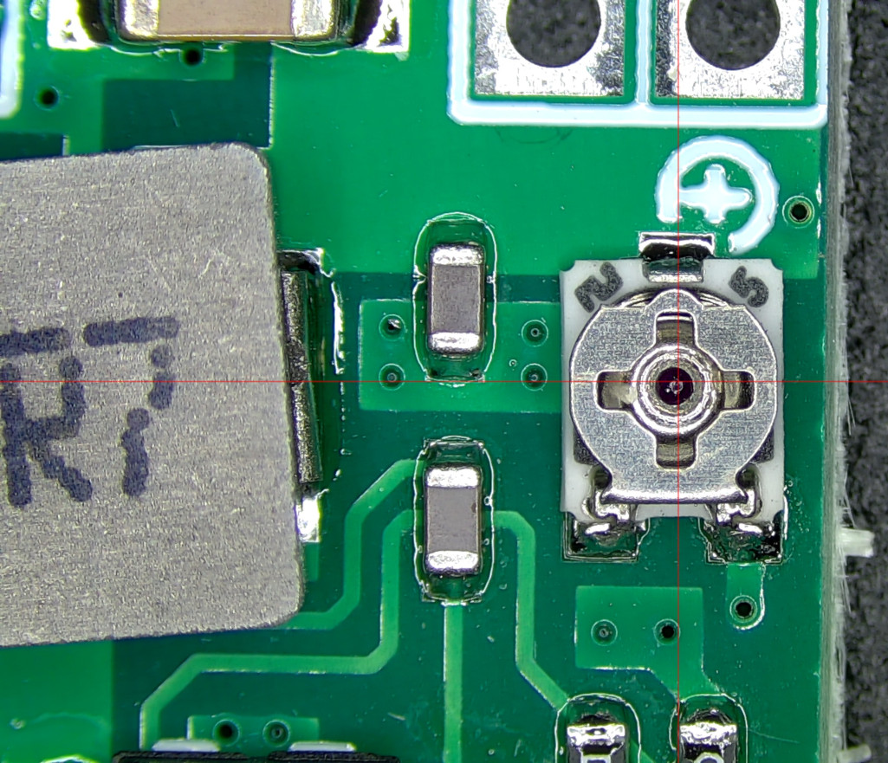
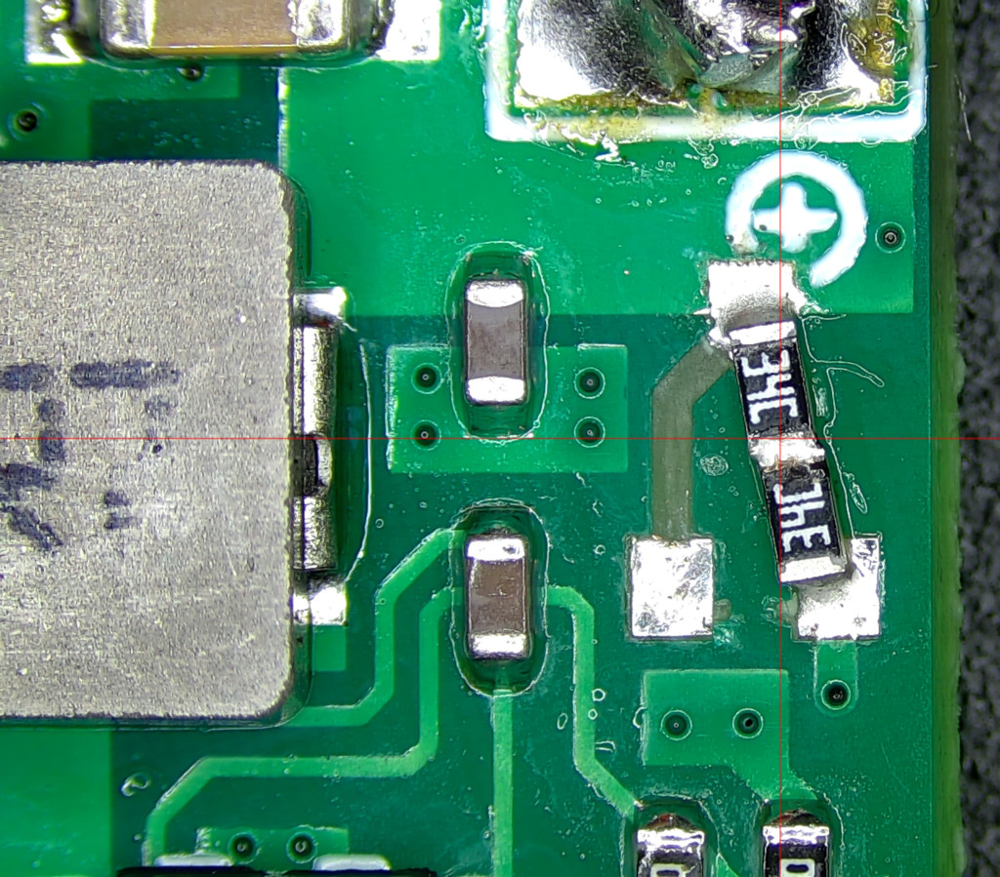
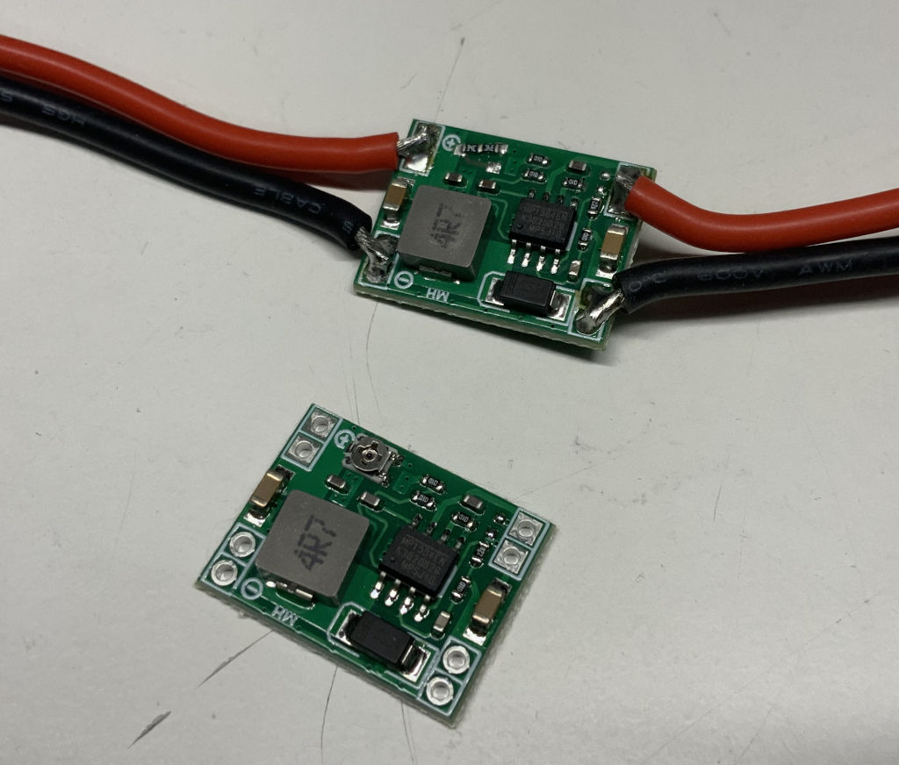
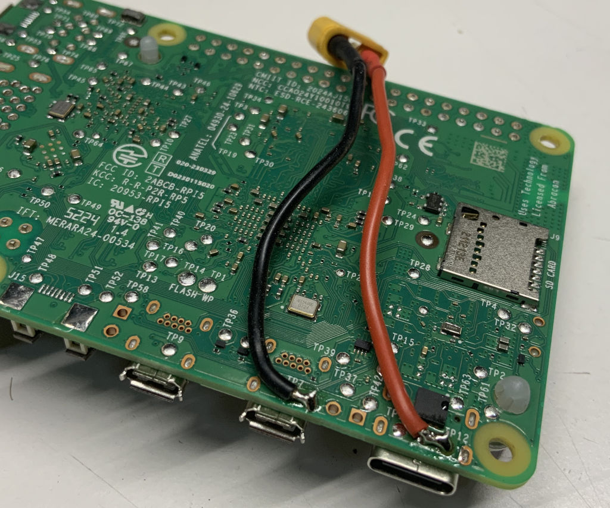
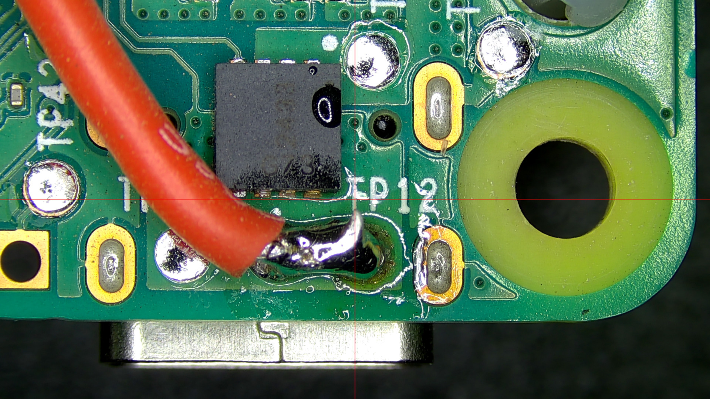
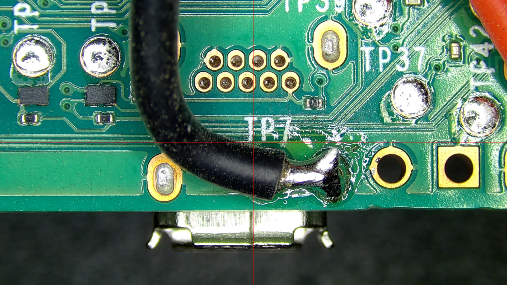
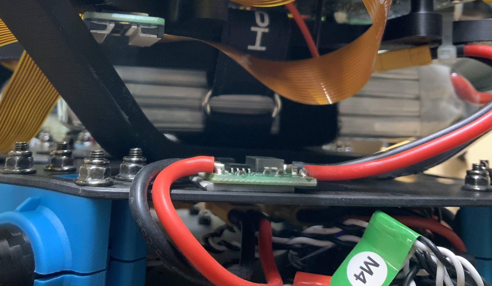

# X500 v2 Platform

Our first drone test platform is based on a [HolyBro X500 v2 "Full Kit"](https://newbeedrone.com/products/holybro-x500-v2-full-kit-pixhawk-6c915mhz-telemetry-radio). The platform as first flown consists of these major components:

| Component                          | Manufacturer | Model                                                        |
| ---------------------------------- | ------------ | ------------------------------------------------------------ |
| Frame                              | HolyBro      | [X500 V2](https://holybro.com/collections/x500-kits/products/x500-v2-kits?variant=42541212008637) |
| Flight Computer                    | HolyBro      | [Pixhawk 6C](https://holybro.com/collections/flight-controllers/products/pixhawk-6c?variant=42783569871037) |
| GPS                                | HolyBro      | [M10 GPS](https://holybro.com/collections/standard-gps-module/products/m10-gps?variant=42991226192061) |
| Motors                             | HolyBro      | [2216 KV920 XT30](https://cdn.shopify.com/s/files/1/0604/5905/7341/files/X500MotorSpec.png?v=1678791632) |
| Electronic Speed Controllers (ESC) | HolyBro      | [BLHeli_S 20A](https://holybro.com/collections/multicopter-kit/products/spare-parts-x500-v2-kit?variant=41591074062525) |
| Power Module                       | HolyBro      | [PM02-V3-12S](https://holybro.com/collections/power-modules-pdbs/products/pm02-v3-12s-power-module) |
| Power Distribution Board (PDB)     | HolyBro      | [PDB 60A](https://holybro.com/collections/power-distribution-board-pdb/products/power-distribution-board-pdb) |
| Telemetry Radio                    | HolyBro      | [SiK V3 915MHz](https://holybro.com/collections/telemetry-radios/products/sik-telemetry-radio-v3) |
| Remote Control Radio               | HolyBro      | [RP3 ELRS Nano](https://holybro.com/collections/rc-radio-transmitter-receiver/products/elrs-receivers-series?variant=42829116047549) |
| Propellers                         | HolyBro      | [1045](https://holybro.com/collections/multicopter-kit/products/spare-parts-x500-v2-kit?variant=41591073669309) |

## Power Distribution

The Power Distribution Board is used to distribute battery voltage to the four motor controllers and two [step-down ("buck") regulators I got from Amazon](https://www.amazon.com/dp/B01MQGMOKI?th=1).

Those regulators were chosen, despite Raspberry Pi Foundation's recommendation for 5 A of current, because in practice these Pis don't require nearly that much current. In particular, we're not attaching any USB devices, so the Pi won't need headroom to provide one or two Amps to USB-attached peripherals. The actual current demand was verified by powering a Pi performing its flight tasks, powered off a lab/bench power supply.

### Regulator Modification

I decided to modify the regulators, replacing the variable resistor that adjusts the output voltage with a pair of fixed resistors in series. This gives an output of about 5.1 V, which is fine for the Raspberry Pi 5, and won't change due to vibration or getting scuffed when the regulator board is handled.

#### Before

I used a soldering iron to pry one end of the variable resistor up off the board. Then I did the same to the other side.

### After

The two replacement resistors size 0603 (imperial) are [labeled "34C", or 22.1 kΩ](https://www.hobby-hour.com/electronics/eia96-smd-resistors.php), ideally 1% tolerance. each. Note that I tore off the trace to the left of the resistors, just to keep things tidy..

I soldered [XT30 connectors and cables (also from Amazon)](https://www.amazon.com/dp/B09LYHHS9J?th=1) to the input and output of each regulator board.

I also soldered a XT30 connector and cable directly to the backside of each Raspberry Pi. This is necessary because the Raspberry Pi's nominal mounting orientation on the camera blocks the USB-C power input on one of the Pis.

I used double-sided 3M VHB tape (included with the X500 kit) to attach the regulators to the bottom carbon fiber plate of the frame, ensuring that the cables were loose between each regulator and Raspberry Pi. I used a small tie-wrap/zip-tie to attach the cable to one of the legs of the top spider arm.

## Flight Computer

The flight computer is a [HolyBro PixHawk 6C](https://docs.holybro.com/autopilot/pixhawk-6c) attached in the center of the top carbon fiber panel of the X500 v2 frame. The flight computer and the attached M10 GPS boom are oriented in the same direction as the vehicle-forward arrow silkscreened on the drone's top panel.

| Flight Computer    | Peripheral                                    |
| ------------------ | --------------------------------------------- |
| POWER1             | PM02 power module                             |
| DSM                | (unused)                                      |
| USB                | (unused)                                      |
| POWER2             | (unused)                                      |
| GPS2               | Dronetag BS radio (Remote ID)                 |
| CAN1               | (unused)                                      |
| GPS1               | M10 GPS receiver                              |
| SBUS OUT           | (unused)                                      |
| CAN2               | (unused)                                      |
| TELEM1             | SiK V2 radio (telemetry)                      |
| TELEM2             | Raspberry Pi "drone-1" MAVlink stream         |
| TELEM3             | RadioMaster ExpressLRS radio (remote control) |
| PPM/SBUS RC        | (unused)                                      |
| I2C                | (unused)                                      |
| FMU PWM OUT (AUX)  | PWM breakout for motors                       |
| I/O PWM OUT (MAIN) | (unused)                                      |

[ArduPilot Copter stable-4.5.7](https://firmware.ardupilot.org/Copter/stable-4.5.7/Pixhawk6C/) was used for the 2025/03/25 and 2025/08/20 farm flights.

The flight computer configuration "params" after the 2025/08/20 flight is in [params.txt](params.txt). It'll be kept current if there are any new flights of this vehicle where parameters are adjusted.

I run [Arch Linux](https://archlinux.org/) on my Intel 12th generation [Framework 13 Laptop](https://frame.work/laptop13). On my laptop, I have been using two different configuration and ground control programs:

* [ArduPilot Mission Planner 1.3.82](https://github.com/ArduPilot/MissionPlanner/releases/tag/MissionPlanner1.3.82) build 1.3.8979.17128
* [QGroundControl v4.4.4](https://github.com/mavlink/qgroundcontrol/releases/tag/v4.4.4)

I have preferred ArduPilot for vehicle setup, as I had some strange compatibility issues between QGroundControl and the ArduPilot firmware. But it could well be that was just operator error. QGroundControl seems nicer to use for mission planning and ground control.

__TODO__: Remove existing geofence that caused the vehicle to prematurely reverse the Auto flight plan and land.

__TODO__: Finish the [tuning process](https://ardupilot.org/copter/docs/common-tuning.html), and adjust flight controller parameters to non-flight-test values:

* ATC_THR_MIX_MAN = 0.5
* PSC_ACCZ_P = MOT_THST_HOVER
* PSC_ACCZ_I = 2 * MOT_THST_HOVER

## Electronic Speed Controllers

I installed BLHeli_S firmware 16.6 on the electronic speed controllers. I did the upgrade using the flight computer's pass-through mode. [This documentation](https://ardupilot.org/copter/docs/common-blheli32-passthru.html#pass-through-support) discusses the pass-through mode. For the firmware update itself, I used the [web-based configurator](https://esc-configurator.com/) in the Chromium browser, as Firefox doesn't support WebUSB yet, apparently.

I am running the ESC interface to the flight computer in DShot600 mode.

## Radio Control

We are flying with a RadioMaster TX16S Mark II ELRS controller. We're using [ExpressLRS 3.5.3 firmware](https://github.com/ExpressLRS/ExpressLRS/releases/tag/3.5.3).

I have these [flight modes](https://ardupilot.org/plane/docs/flight-modes.html#major-flight-modes) configured on the six buttons in the middle of the controller:

| Button        | Flight Mode                                                  | Uses                                                         |
| ------------- | ------------------------------------------------------------ | ------------------------------------------------------------ |
| 1 (left-most) | [Stabilize](https://ardupilot.org/copter/docs/stabilize-mode.html) | Flight Testing, Verifying Configuration                      |
| 2             | [Altitude Hold](https://ardupilot.org/copter/docs/altholdmode.html) | Easier hand-flying                                           |
| 3             | [Loiter](https://ardupilot.org/copter/docs/loiter-mode.html) | (__TODO__: replace with [Position Hold](https://ardupilot.org/copter/docs/poshold-mode.html)?) |
| 4             | [Auto](https://ardupilot.org/copter/docs/auto-mode.html)     | Fly pre-programmed mission                                   |
| 5             | [Return to Launch](https://ardupilot.org/copter/docs/rtl-mode.html) | Land with minimum risk, assuming ample battery               |
| 6             | [Land](https://ardupilot.org/copter/docs/land-mode.html)     | Land immediately, assuming power loss is imminent            |

__Hard-won lesson__: Any time you make changes to the vehicle, do an initial test flight using "Stabilize". Other, more automatic flight modes make assumptions about the vehicle's setup being correct. And this is how I flipped and broke parts on the vehicle twice after integrating the spider camera mount -- I put motor/beam assemblies back in the wrong places, and effectively had motors swapped.

## 3D Printed Components

The camera platform is made of 3D-printed parts.

Since the camera platform is mounted to the underside of the drone, it was necessary to replace the X500 V2 kit's landing gear with 3D-printed legs attached at the ends of the motor booms.

Models are in [3d print files](3d%20print%20files).

## Cameras

The camera system consists of three [Arducam B0262 camera assemblies](https://docs.arducam.com/Raspberry-Pi-Camera/Native-camera/12MP-IMX477/#product-catalog), built around the Sony IMX477 sensor. The Arducam B0262 comes with a 90° diagonal, 75° horizontal, 56.3° vertical field of view lens.

__TODO__: Consider sourcing M12 lenses with a narrower field of view (FoV) because the Arducam B0262 camera lenses have significant distortion toward the edges. One potential source: https://commonlands.com/collections/m12-lenses

__TODO__: Get 22-pin, 0.5 mm pitch MIPI-CSI cables both to clean up cable routing and upgrade the MIPI-CSI interface to four lanes, which should improve readout rate and reduce rolling shutter issues.

## Camera Computers

A full description of the camera computers [can be found elsewhere in this repository](../../software/camera-computer/).
